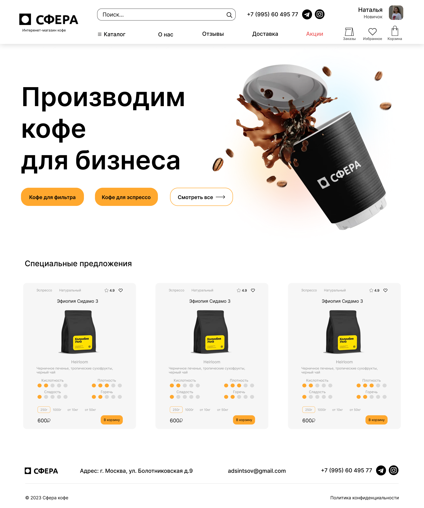
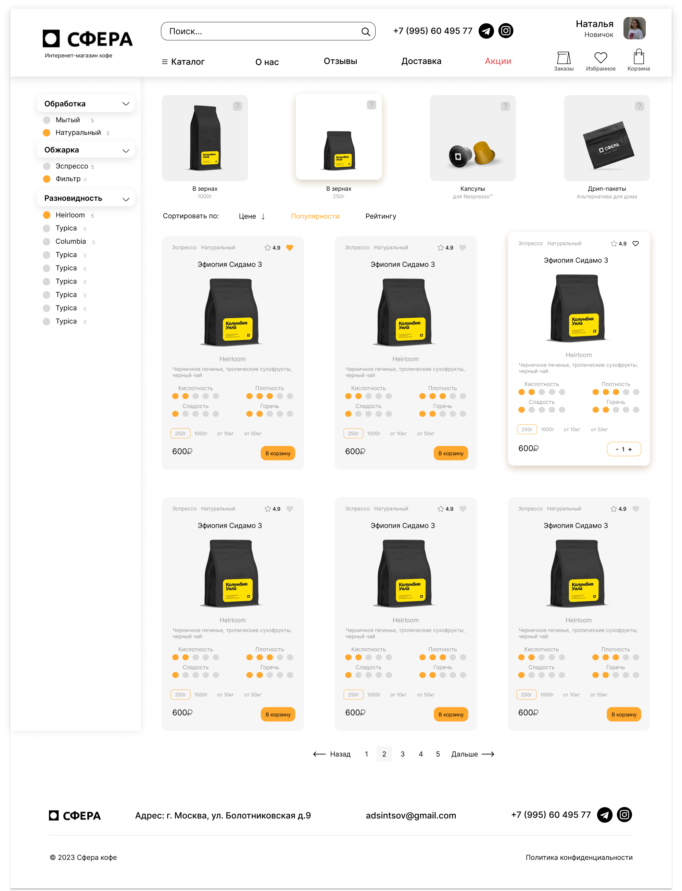
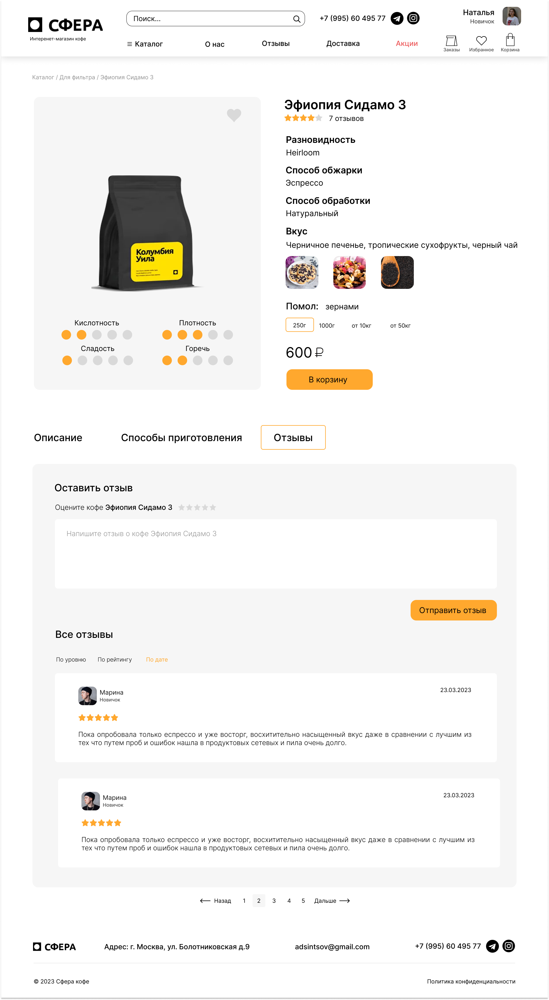
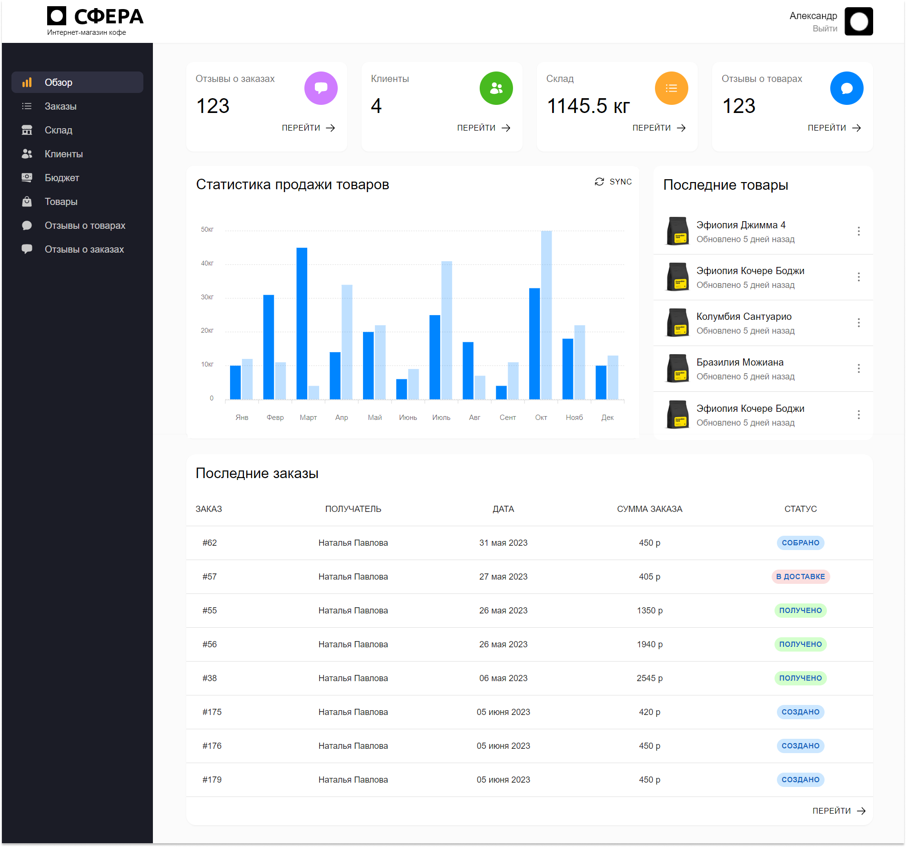

# Фронтенд часть интернет-магазина для компании по изготовлению и продаже кофе для бизнеса

### [Бэкенд часть](https://github.com/NPavlovaaa/sphera_backend)  
### [Макеты в Figma](https://www.figma.com/file/n85vhpwbaihjJuZnDTON6W/Untitled?type=design&node-id=0%3A1&mode=design&t=YtG4eKwyjQl2OctR-1)  

### Главная страница, каталог и страница товара

  
  

### Панель администратора

## Технологии
- ReactJS;
- Redux Toolkit;
- RTK Query;
- Tailwind Css;
- Formik and Yup;

## Выполненные задачи

- Разработка интернет-магазина с 3 ролями: клиент, администратор и менеджер.
- Разработка административной панели.
- Разработка базы данных.
- Разработка API.
- Разработка UI/UX.
- Интеграция тестовой оплаты Tinkoff.
- Интеграция сервиса доставки Dostavista.

